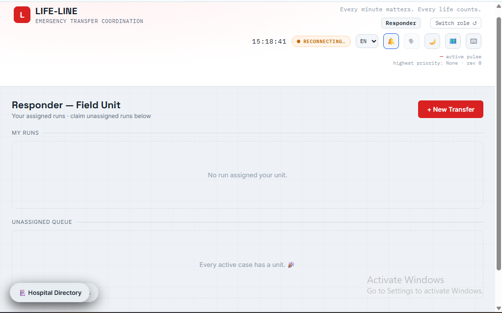
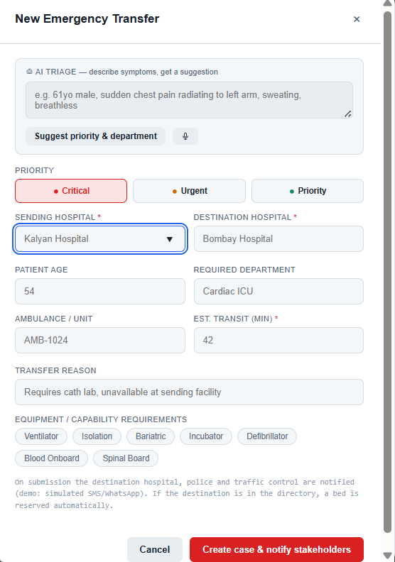
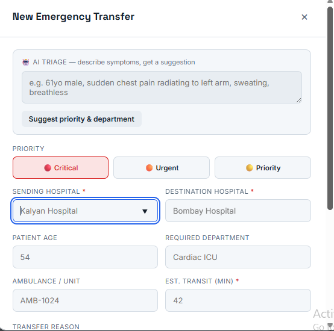
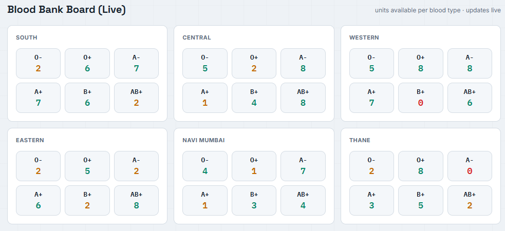

# Life-Line — Emergency Transfer Coordination

A live-synced coordination board for ambulance-to-hospital handoffs, built as
a zero-dependency Python + vanilla JS app (no pip install, no build step).

**Live demo:** https://lifeline-five-omega.vercel.app/

## Why

In Indian metros, ambulance-to-hospital handoffs lose time in dumb ways: a
responder calls a hospital that turns out to have no ICU beds, command only
hears about a delayed transfer when someone rings in, a mass-casualty scene
has no shared picture of who's headed where. Life-Line puts responders,
sending/destination hospitals, police, traffic control and command on one
shared live state, and hands the two jobs a human shouldn't have to do under
pressure to AI: turning messy field notes into a triage suggestion, and
turning the whole board into a five-second briefing.

Two things in here are genuinely AI-powered — triage suggestions and the
situation report — and both are honest about it. If `LIFELINE_ANTHROPIC_KEY`
is set they call Claude; if not, they fall back to an offline heuristic and
say so in the response (`"mode": "heuristic"`). Nothing pretends to be AI
that isn't. Destination recommendation and ETA prediction are plain
rule-based scoring, not AI, always.

## Screenshots

| Responder | Command center |
|---|---|
|  |  |

| AI Situation Report | Blood Bank |
|---|---|
|  |  |

## Running it

You need Python 3.8+ and a browser. That's the whole dependency list — the
server is standard library only.

```bash
git clone https://github.com/kukrejaagirish/lifeline.git
cd lifeline
python3 server.py        # Windows: start.bat, or python server.py
```

First run creates `data/lifeline.db`, seeds demo hospitals/units/cases, and
prints a startup banner. Open **http://127.0.0.1:8787** and pick a role —
`AMB-1024` for the responder view, or Command Center for the full dashboard.
Open it in a few tabs (or from another device on the same network via
`http://<your-ip>:8787`) and watch actions sync across them live.

No Python handy? Open `public/index.html` directly — it detects the missing
server and runs in offline demo mode with mock data.

**Troubleshooting**
- `python is not recognized` → install Python, tick "Add to PATH", or use `py -3 server.py` on Windows.
- Port in use → `python server.py --port 8788`.
- Stuck on OFFLINE DEMO → make sure `server.py` is actually running and you're on the right host/port.
- Want a clean slate → stop the server, delete `data/lifeline.db`, restart (or run with `--fresh`).

## What's in it

Backend (`server.py`, stdlib only): SQLite persistence, an SLA watchdog that
auto-escalates stale cases and flags delayed transfers, a notification log
(SMS/WhatsApp — simulated unless Twilio is configured), destination
recommendation and ETA prediction, AI triage and situation-report endpoints,
mass-casualty incident tracking, a handover proof-of-delivery checklist,
equipment tags, operator-ID sessions, optional TLS, rate
limiting, and CSV report export.

Frontend (`public/`): the AI triage box (typed or spoken notes → suggested
priority/dept/equipment), the AI situation report button, a live Leaflet map
with bed-pressure-colored hospital markers and animated transfer routes,
Hindi/Marathi alongside English, light/dark theme, voice announcements for
critical/delayed transfers, destination suggestions with ETA hints while
typing, the MCI banner, the handover checklist, and a PWA shell so it still
loads offline once you've visited it once. Keyboard shortcuts: `N` new case,
`/` search, `M` map, `T` theme, `V` voice, `Esc` close, `?` help.

## CLI flags

```
python server.py [--host 127.0.0.1] [--port 8787] [--fresh] [--no-sim]
                 [--region mumbai] [--tls --cert FILE --key FILE]
```

`--fresh` wipes the saved database and reseeds demo data. `--no-sim` turns
off the background simulation (the SLA watchdog keeps running regardless).
`--region` picks the dataset (only `mumbai` right now).

## Environment variables

Settings can go in a `.env` file next to `server.py` (see `.env.example`);
real env vars win if both are set.

- `LIFELINE_TWILIO_SID` / `LIFELINE_TWILIO_AUTH` / `LIFELINE_TWILIO_FROM` — real SMS/WhatsApp via Twilio. Unset = dispatch is logged as `simulated`.
- `LIFELINE_ANTHROPIC_KEY` — real AI triage/situation-report via Claude. Unset = heuristic fallback, reported honestly as `"mode": "heuristic"`.
- `LIFELINE_ANTHROPIC_MODEL` — override the model (default `claude-sonnet-5`).
- `LIFELINE_SLA_REGISTER_MIN` (default `10`) — minutes a case can sit REGISTERED before auto-escalation.
- `LIFELINE_DELAY_GRACE_MIN` (default `10`) — grace minutes past ETA before a transfer is flagged DELAYED.
- `LIFELINE_RATE_LIMIT` (default `120`) — POST requests per minute per IP.

The active dispatch mode shows up in `/api/health`, the startup banner, and
the command dashboard's notification panel — so you always know if you're
looking at real or simulated sends.

### Wiring up real Twilio SMS/WhatsApp

1. Create an account at [console.twilio.com](https://console.twilio.com) and grab the Account SID and Auth Token.
2. Get a sending number — buy one or use the trial number for SMS; for WhatsApp, use the sandbox number `+14155238886` (each recipient has to text the join code to it first).
3. On a trial account you can only message verified numbers — verify yours under *Phone Numbers → Verified Caller IDs*.
4. Copy `.env.example` to `.env` and fill in `LIFELINE_TWILIO_SID`, `LIFELINE_TWILIO_AUTH`, `LIFELINE_TWILIO_FROM`.
5. Restart. The banner should read **LIVE (Twilio)**, and each message's real delivery status shows up in the notification log.

## API

All mutating routes need `Authorization: Bearer <token>` from `/api/login`.

Reads: `/api/health`, `/api/state`, `/api/events` (SSE stream), `/api/hospitals`,
`/api/audit`, `/api/notifications`, `/api/recommend`, `/api/predict`,
`/api/situation-report`, `/api/report.csv`.

Writes: `/api/login`, `/api/users/register`, `/api/logout`, `/api/cases`
(create), `/api/cases/{id}/status|claim|assign|traffic|notes|cancel|escalate|handover`,
`/api/triage`, `/api/incidents` (create/close).

Most of these map pretty directly to what they sound like — check
`server.py`'s route table (`ROUTES` near the bottom) if you need exact
payload shapes.

## How it stays in sync

Every mutation bumps a revision counter, writes through to SQLite
immediately, and broadcasts a full state snapshot over SSE. Clients just
re-render from whatever snapshot arrives, so every open tab converges to the
same state without any client-side merge logic.

## Disclaimer

This is demo/training software with mock Mumbai-area data — not for real
dispatch. Hospital bed counts are simulated. SMS/WhatsApp is simulated unless
Twilio is configured (the notification log always shows the true delivery
status). Verify emergency numbers independently.


## Command Center Dispatch

Command Center operators can dispatch an available ambulance directly from an active case. The dispatch workflow validates that the selected unit exists and is available, assigns it to the case, marks it en route, records an audit event, broadcasts the updated state to connected clients, and emits the configured dispatch notification. Responders then see the assigned run in their queue and can advance its status.

Dispatch is intentionally separate from responder self-claiming: **Command Center dispatches; Responders claim only unassigned runs**.

## Security / authentication

Secure authentication is enabled by default. See `.env.example` and `SECURITY.md`.
